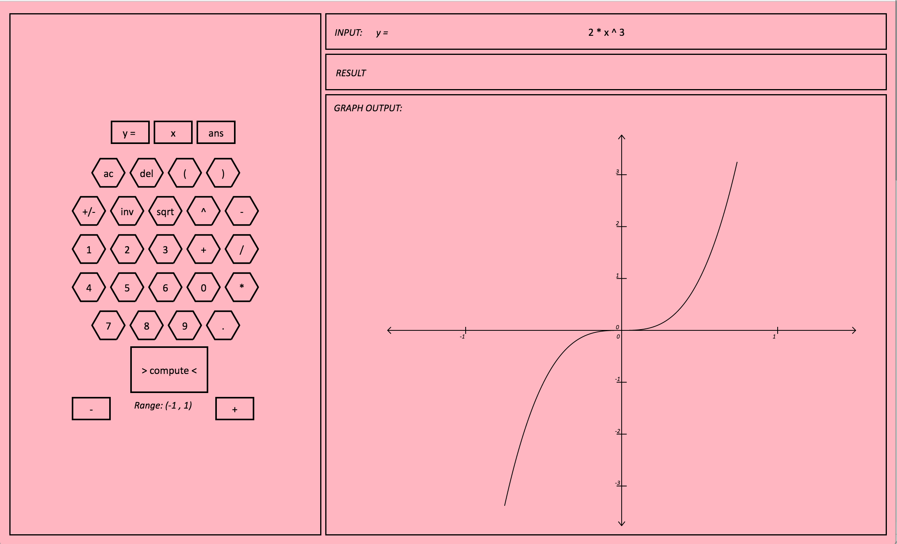

# Graphex
##### A virtual graphing calculator for the web using Functional Reactive Programming with Elm

Project Team:  Zakir Gowani, Benjamin Rohrer



##### Features:
- A custom recursive parsing system that respects parentheses and the order of operations
- Basic binary arithmetic operators are supported (+, -, *, / , ^), and a basic unary operator (~, negation).
- Graph mode toggle: when the “y=” string is shown in the INPUT panel, graph mode is toggled on; this means that the string in the INPUT panel will be graphed. Graph mode can either be toggled using the “y=” button or by including the variable x in the INPUT string.
- A range interval is shown below the button layout; the buttons to either side either zoom in or zoom out on the displayed graph. We cap the maximum range at (-17,17); we cap the minimum range at (-1,1).


##### Build and run with:
```
git clone https://github.com/ZakirG/elm-graphing-calculator.git
cd elm-graphing-calculator/
elm make Interface.elm --output=int.html
open -a Google\ Chrome int.html
```
And replace "Google\ Chrome" with your preferred browser. You may be prompted to install Elm. 


This application was well-suited for a functional language.

A number of dynamically generated features of the GUI come from mappings of functions onto lists of ranges. 

For example, the graph ticks are generated on the fly, building lists of graphics elements from lists of numbers.

This application does not use CSS; all UI features are generated functionally with Elm.